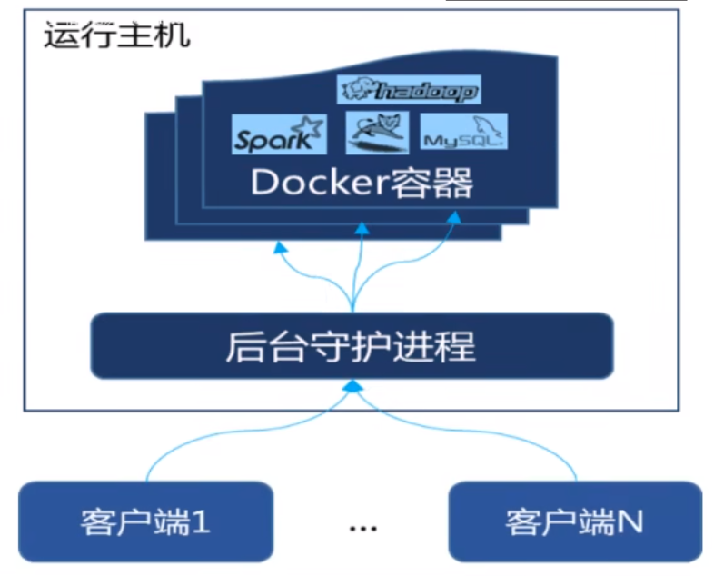

[TOC]


# 1.Docker是什么

## 1.1为什么会有docker

假定您在开发一个尚硅谷的谷粒商城，您使用的是一台笔记本电脑而且您的开发环境具有特定的配置。其他开发人员身处的环境配置也各有不同。您正在开发的应用依赖于您当前的配置且还要依赖于某些配置文件。此外，您的企业还拥有标准化的测试和生产环境,且具有自身的配置和一系列支持文件。您希望尽可能多在本地模拟这些环境而不产生重新创建服务器环境的开销。请问?
您要如何确保应用能够在这些环境中运行和通过质量检测﹖并且在部署过程中不出现令人头疼的版本、配置问题，也无需重新编写代码和进行故障修复?

答案就是使用容器。Docker之所以发展如此迅速，也是因为它对此给出了一个标准化的解决方案---系统平滑移植，容器虚拟化技术。

环境配置相当麻烦，换一台机器，就要重来一次，费力费时。很多人想到，能不能从根本上解决问题，软件可以带环境安装﹖也就是说，安装的时候，把原始环境一模一样地复制过来。开发人员利用Docker可以消除协作编码时“在我的机器上可正常工作”的问题。


之前在服务器配置一个应用的运行环境，要安装各种软件，就拿尚硅谷电商项目的环境来说，Java/RabbitMQMySQLJDBC驱动包等。
安装和配置这些东西有多麻烦就不说了，它还不能跨平台。假如我们是在Windows上安装的这些环境，到了Linux又得重新装。 
况且就算不跨操作系统，换另一台同样操作系统的服务器，要移植应用也是非常麻烦的。
传统上认为，软件编码开发0刚试结束后，所产出的成果即是程序或是能够编译执行的二进制字节码等(java为例)。
而为了让这些程序可以顺利执行，开发团队也得准备完整的部署文件，让维运团队得以部署应用程式，开发需要清楚的告诉运维部署团队，
用的全部配置文件+所有软件环境。不过，即便如此，仍然常常发生部署失败的状况。Docker的出现使得Docker得以打破过去「程序即应用」的观念。透过镜像(images)将作业系统核心除外，运作应用程式所需要的系统环境，由下而上打包，达到应用程式跨平台间的无缝接轨运作。

## 1.2docker理念

一次镜像，处处运行

Docker的主要目标是“_Build，Ship and Run Any App.Anywhere_”，也就是通过对应用组件的封装、分发、部署、运行等生命周期的管理，使用户的APP(可以是一个WEB应用或数据库应用等等）及其运行环境能够做到“_一次镜像，处处运行_”。


Linux容器技术的出现就解决了这样一个问题，而Docker就是在它的基础上发展过来的。将应用打成镜像，通过镜像成为运行在Docker容器上面的实例，而Docker容器在任何操作系统上都是一致的，这就实现了跨平台、跨服务器。只需要一次配置好环境，换到别的机子上就可以一键部署好，大大简化了操作。

## 1.3容器与虚拟机比较

### 1.3.1传统虚拟化技术
虚拟机（virtual machine）就是带环境安装的一种解决方案。
它可以在一种操作系绕里面运行另一种操作系统，比如在Windows10系统里面运行Linux系统CentOS7。应用程序对此毫无感知，因为虚拟机看上去跟真实系统一模一样，而对于底层系统来说，虚拟机就是一个普通文件，不需要了就删掉，对其他部分毫无影响。这类虚拟机完美的运行了另一套系统，能够使应用程序，操作系统和硬件三者之间的逻辑不变。

- win10
- VMWare
- Centos7
- 各种cpu，内存网络配置+各种软件
- 虚拟机实例化

传统虚拟机技术基于安装在主操作系统上的虚拟机管理系统(如:VirtualBox和VMWare等)，创建虚拟机(虚拟出各种硬件)，在虚拟机上安装从操作系统，在从操作系统中安装部署各种应用。


缺点：
- 资源占用多
- 冗余步骤多
- 启动慢

### 1.3.2容器虚拟化技术

由于前面虚拟机存在某些缺点，Linux发展出了另一种虚拟化技术:Linux容器（Linux Containers,缩写LXC）

Linux容器是与系统其他部分隔离开的一系列进程，从另一个镜像运行，并由该镜像提供支持进程所需的全部文件。容器提供的镜像包含了应用的所有依赖项，因而在从开发到测试再到生产的整个过程中，它都具有可移植性和一致性。

Linux容器不是模拟一个完整的操作系统而是对进程进行隔离。有了容器，就可以将软件运行所需的所有资源打包到一个隔离的容器中。容器与虚拟机不同，不需要捆绑一整套操作系统，只需要软件工作所需的库资源和设置。系统因此而变得高效轻量并保证部署在任何环境中的软件都能始终如一地运行。I


Docker容器是在操作系统层面上实现虚拟化，直接复用本地主机的操作系统，而传统虚拟机则是在硬件层面实现虚拟化。与传统的虚拟机相比，Docker优势体现为启动速度快、占用体积小。

### 1.3.3比较
不同之处
- 传统虚拟机技术是虚拟出一套硬件后，在其上运行一个完整操作系统，在该系统上再运行所需应用进程;
- 容器内的应用进程直接运行于宿主的内核，容器内没有自己的内核且也没有进行硬件虚拟。因此容器要比传统虚拟机更为轻便。
- 每个容器之间互相隔离，每个容器有自己的文件系统，容器之间进程不会相互影响，能区分计算资源。


# 2.docker下载和安装
## 2.1官网
docker官网：http://www.docker.com
Github仓库：https://hub.docker.com/

## 2.2前提条件
- CentOS仅发行版本中的内核支持Docker。Docker运行在CentOS 7 64位上
- 要求系统是64位，Linux系统内核为3.8以上
### 2.2.1查看自己内核
```shell
cat /etc/redhat-release

uname - r
```
## 2.3安装
### 2.3.1安装地址
https://docs.docker.com/engine/install/centos/
### 2.3.2安装步骤
- 确认是centos7版本使用：cat/etc/redhat-release
- 卸载旧版本
```shell
sudo yum remove docker \
                  docker-client \
                  docker-client-latest \
                  docker-common \
                  docker-latest \
                  docker-latest-logrotate \
                  docker-logrotate \
                  docker-engine
```
- yum安装gcc相关
```shell
yum -y install gcc
yum -y install gcc-c++
```
- 安装需要的文件包
```shell
yum install -y yum-utils
```
- 设置stable镜像仓库
```shell
yum-config-manager \
    --add-repo \
    https://mirrors.aliyun.com/docker-ce/linux/centos/docker-ce.repo
```
- 更新yum软件包索引
```shell
yum makecache fast
```
- 安装docker ce
```shell
yum install docker-ce docker-ce-cli containerd.io
```
- 启动docker
```shell
systemctl start docker
# 查看进程
ps -ef|grep docker
```
- 运行hello world
```shell
docker run hello-world
```
- 卸载
```shell
# 关服务
systemctl stop docker
# remove
yum remove docker-ce docker-ce-cli containerd.io

rm -rf /var/lib/docker
rm -rf /var/lib/containerd
```
## 2.4阿里云镜像加速
登录阿里云，进入容器镜像服务，控制台，镜像加速
```shell
# 1
mkdir -p /etc/docker
# 2
tee /etc/docker/daemon.json <<-'EOF'
{
  "registry-mirrors": ["https://2ty6gjae.mirror.aliyuncs.com"]
}
EOF
# 3
systemctl daemon-reload
# 4
systemctl restart docker
```

# 3.docker的基础组成

## 3.1镜像（image）

Docker镜像（image）就是一个只读模板，镜像可以用来创建Docker容器，一个镜像可以创建多个容器。它也相当于是一个root文件系统。比容官方镜像centos：7就是包含了完整的centos：7最想系统的root文件系统。相当于容器的“源代码”，docker镜像文件类型于Java的类模板（class文件），而docker容器实例类似于java中new出来的实例对象。

容器与镜像的关系类似于面对对象变成中的对象与类

| docker | 面对对象 |
| ------ | -------- |
| 容器   | 对象     |
| 镜像   | 类       |

## 3.2容器（container）

 **1.从面对对象的角度**

Docker利用容器(Container）独立运行的一个或一组应用，应用程序或服务运行在容器里面，容器就类似于一个虚拟化的运行环境，容器是用镜像创建的运行实例。就像是Java中的类和实例对象一样，镜像是静态的定义，容器是镜像运行时的实体。容器为镜像提供了一个标准的和隔离的运行环境,它可以被启动、开始、停止、删除。每个容器都是相互隔离的、保证安全的平台。

**2.从镜像容器的角度**

可以把容器看做是一个简易版的Linux环境(包括root用户权限、进程空间、用户空间和网络空间等）和运行在其中的应用程序。

## 3.3仓库（repository）

存放镜像文件存放的地方，例如maven

# 4.docker平台架构图解
## 4.1入门
### 4.1.1图解


### 4.1.2工作原理

Docker是一个Client-Service结构的系统，Docker守护进程运行在主机上，然后同故宫socket连接从客户端访问，守护进程从客户端接收命令并管理运行在主机上的容器。容器，是一个运行时环境，可以理解为集装箱。



## 4.2架构版

### 4.2.1架构及底层通信原理简述

Docker是一个CIS模式的架构，后端是一个松耦合架构，众多模块各司其职。

**Docker的运行的基本流程：**

- 1 用户是使用Docker Client 与 Docker Daemon建立通信，并发送请求给后者。
- 2 Docker Daemon作为Docker架构中的主体部分，首先提供Docker Server的功能使其可以接受Docket Client的请求。
- 3 Docker Engine执行Docker内部的一系列工作，每一项工作都是以一个Job的形式的存在。
- 4 Job的运行过程中，当需要容器镜像时，则从 Docker Registry中下载镜像，并通过镜像管理驱动Grapr driver将下载镜像以Graph的形式存储。
- 5 当需要为Docker创建网络环境时，通过网络管理驱动Network driver创建并配置Docker容器网络环境
- 6 当需要限制Docker容器运行资源或执行用户指令等操作时，则通过Exec driver来完成。
- 7 Libcontainer是一项独立的容器管理包，Network driver以及Exec driver都是通过Libcontainer来实现具体对容器进行的操作。


# 5.docker常用命令
## 5.1帮助启动类命令
```shell
# 启动docker
systemctl start docker
# 停止docker
systemctl stop docker
# 重启
systemctl restart docker
# 查看docker状态
systemctl status docker
# 开机自动启动
systemctl enable docker
# 查看docker概要信息
docker info 
# 查看docker总体帮助文档
docker --help
# 查看docker命令帮助文档
docker [具体命令] --help
```

## 5.2镜像命令
### 5.2.1列出本地主机上的镜像文件
```shell
docker images [可选参数]

```
**各个选项说明:**

| 参数         | 说明       |
|------------|----------|
| REPOSITORY | 表示镜像的仓库源 |
| TAG        | 镜像的标签    |
| IMAGE ID   | 镜像的ID    |
| CREATED    | 镜像创建时间   |
| SIZE       | 镜像大小     |

> 同一仓库源可以有多个TAG版本，代表这个仓库的不同版本，我们使用REPOSITORY:RAG来定义不同的镜像。
> 如果你不指定一个镜像的版本标签，例如ubuntu，docker将默认使用ubuntu:latest镜像
> 
****可选参数:****

| 可选参数 | 说明       |
|------|----------|
| -a   | 列出本地所有镜像 |
| -p   | 只显示镜像ID  |

### 5.2.2查询镜像信息
```shell
# 语法
docker search [可选参数] <镜像名>
# 实例
docker search --limit 5 redis 
```
**各个选项说明:**

| 参数          | 说明       |
|-------------|----------|
| NAME        | 镜像名称     |
| DESCRIPTION | 镜像说明     |
| STARS       | 点赞数量     |
| OFFICIAL    | 是否是官方的   |
| AUTOMATED   | 是否是自动构建的 |

**可选参数:**

| 可选参数    | 说明     |
|---------|--------|
| --limit | 限制显示个数 |

### 5.2.3下载镜像
```shell
# 语法
docker pull <镜像名>[:TAG]
# 实例
docker pull hello-world
```
**说明:**
- 没有TAG版本默认下载最新版

### 5.2.4查看镜像/容器/数据卷所占空间
```shell
docker system df 
```

### 5.2.5删除镜像
```shell
# 语法
docker rmi [可选参数] <镜像名/ID>
# 实例
docker rmi -f feb5d9fea6a5
docker rmi -f $(docker images -qa)
```
**可选参数:**

| 可选参数 | 说明     |
| -------- | -------- |
| -f       | 强制删除 |

## 5.3容器命令
有镜像才能创建容器，这是根本前提
```shell
# 下载ubuntu演示
docker pull ubuntu
```
### 5.3.1新建+启动
```shell
docker run [可选参数] image[COMMAND] [ARG...]
# 实例 /bin/bash 交互式shell 退出 exit
docker run -it --name=<自定义> ubuntu /bin/bash 
```
**可选参数：**

| 可选参数   | 说明                            |
|--------|-------------------------------|
| --name | 为容器指定一个名称                     |
| -d     | 后台运行容器并返回容器ID，也叫启动守护式容器（后台运行） |
| -i     | 以交互式运行容器，通常与-t同时使用            |
| -t     | 为容器重新分配一个伪输入终端，通常与-i同时使用      |
| -P     | 随机端口映射                        |
| -p     | 指定端口映射                        |

### 5.3.2列出所有正在运行的容器
```shell
docker ps [可选参数]
```

| 可选参数 | 说明                  |
|------|---------------------|
| -a   | 列出当前所有正在运行的容器+历史运行过 |
| -i   | 显示最近创建的容器           |
| -n   | 显示最近n个创建的容器         |
| -q   | 安静模式，只显示容器编号        |

### 5.3.3退出容器
```shell
# 第一种
exit
# 第二种
ctrl + p + q
```

### 5.3.4启动已停止运行的容器
```shell
docker start [容器ID或容器名]
```

### 5.3.5重启容器
```shell
docker restart [容器ID或容器名]
```

### 5.3.6停止容器
```shell
docker stop [容器ID或容器名]
```

### 5.3.7强制停止容器
```shell
docker kill [容器ID或容器名]
```

### 5.3.8删除容器
```shell
docker stop [容器ID或容器名]
docler rm [容器ID或容器名]
# 强制删除
docler rm -f [容器ID或容器名]
# 一次性删除多个容器实例
docker rm -f $(docker ps -a -p)
docker ps -a -q |xargs docker rm
```

### 5.3.9重要
- 守护式容器（后台服务）
```shell
docker run -d [容器名]
```

问题：

使用指令后，然后使用docker ps -a进行查看，会发现容器已经退出了很重要的一点：docker容器后台运行就必须有一个前台进程，容器运行的命令如果不是那些一直挂起的命令（比如运行top,tail），就会自动退出。
这个是docker的机制问题,比如你的web容器,我们以nginx为例，正常情况下，我们配置启动服务只需要启动响应的service即可。例如service nginx start但是,这样做,nginx为后台进程模式运行,就导致docker前台没有运行的应用，这样的容器后台启动后,会立即自杀因为他觉得他没事可做了.
所以，最佳的解决方案是,将你要运行的程序以前台进程的形式运行，常见就是命令行模式，表示我还有交互操作，别中断，o(n_n)O哈哈~


- redis前后台启动
  - 前台启动：docker run -it redis[:TAG]
  - 后台启动：docker run -d redis[:TAG]


- 查看容器日志

```shell
docker logs [容器ID]
```


- 查看容器内运行的进程

```shell
docker top
```


- 查看容器内部细节

```shell
docker inspect [容器ID]
```


- 进入正在运行的容器，并以命令行交互

```shell
# 第一种 推荐使用
docker exec -it [容器ID] /bin/bash
# 第二种
docker attach [容器ID]
```

> 区别：
>
> attach 直接进入容器启动命令的终端，不会启动新的进程用exit退出，会导致容器的停止。
>
> exec是在容器种打开新的终端，并且可以启动新的进程用exit退出，不会导致容器的停止。

```shell
docker run -it ubuntu /bin/bash
ctrl + p + q 退出
docker exec -it [容器ID] /bin/bash
exit
# 容器还在与性能
```


- 从容器内拷贝到在主机

```shell
docker cp [容器ID:容器内路径 目的主机路径]

# 实例
docker run -it ba6acccedd29 /bin/bash
# 进入ubuntu
cd /tmp
touch a.txt
# ctrl + p + q 退出
docker cp ba6acccedd29:/tmp/a.ext /tmp
```


- 导入导出容器

```shell
# 导出
docker export [容器ID] > 文件名.tar
# 实例
docker export 8db058204d15 > /tmp/docker-cp-images/test1.tar

# 导入
cat 文件名.tar | docker import -镜像用户/镜像名:镜像版本号
# 实例
cat /tmp/docker-cp-images/test1.tar | docker import - sgming/redis:6.0.8
# 使用docker images 可以看到
REPOSITORY     TAG       IMAGE ID       CREATED          SIZE
sgming/redis   6.0.8     918d2bc2492d   11 seconds ago   101MB
ubuntu         latest    ba6acccedd29   13 months ago    72.8MB
redis          6.0.8     16ecd2772934   2 years ago      104MB
```


### 5.3.10小总结

| 指令    | 英语解释                                    | 中文说明                              |
| ------- | ------------------------------------------- | ------------------------------------- |
| build   | Build an image from a Dockerfile            | 通过Dockerfile定制镜像                |
| commit  | Create a new image from a container changes | 提交当前容器为新的镜像                |
| create  | Create a new container                      | 创建一个新的容器，同run，但不启动容器 |
| diff    | Inspect changes on a container`s filesystem | 查看docker容器变化                    |
| events  | Get real time events from the server        | 从docker服务获取容器实时事件          |
| history | Show the history of an image                | 展示一个镜像形成历史                  |


# 6.Docker镜像

是一种轻量级、可执行的独立软件包，它包含运行某个软件所需的所有内容，我们把应用程序和配置依赖打包好形成一个可交付的运行环境(包括代码、运行时需要的库、环境变量和配置文件等)，这个打包好的运行环境就是image镜像文件。

## 6.1是什么

 ### 6.1.1是分层的

以我们pull为例，在下载的过程中我们可以看到docker的镜像好像是一层一层的在下载

### 6.1.2UnionFS(联合文件系统)

UnionFS（联合文件系统):Union文件系统〈UnionFS〉是一种分层、轻量级并且高性能的文件系统，它支持对文件系统的修改作为一次提交来一层层的叠加，同时可以将不同目录挂载到同一个虚拟文件系统下(unite several directories into a single virtual
filesystem)。Union文件系统是Docker镜像的基础。镜像可以通过分层来进行继承，基于基础镜像（没有父镜像），可以制作各种具体的应用镜像。

**特性：**

一次同时加载多个文件系统，但从外面看起来，只能看到一个文件系统，联合加载会把各层文件系统叠加起来，这样最终文件系统包含所有底层的文件和目录

### 6.1.3镜像加载原理

docker的镜像实际上由一层一层的文件系统组成，这种层级的文件系统UnionFS。

bootfs(boot file system)主要包含bootloader和kernel, bootloader主要是引导加载kernel, Linux刚启动时会加载bootfs文件系统，在Docker镜像的最底层是引导文件系统bootfs。这一层与我们典型的Linux/Unix系统是一样的，包含boot加载器和内核。当boot加载完成之后整个内核就都在内存中了，此时内存的使用权已由bootfs转交给内核，此时系统也会卸载bootfs。

rootfs (root file system)，在bootfs之上。包含的就是典型Linux系统中的/dev, /proc, bin, letc等等标准目录和文件。rootis就是各种不同的操作系统发行版，比如Ubuntu，Centos等等。

### 6.1.4为什么Dockers镜像要采用分层结构

镜像分层最大的好处就是共享资源，方便复制迁移，就是为了复用

比如说有个镜像都是从相同的base镜像构建而来，那么Docker Host只需在磁盘上保存一份base镜像；同时内存中也只需要加载一份base镜像，就可以为所有容器服务了。而且镜像的每一层都可以被共享


## 6.2重点理解

Docker镜像层都是只读的，容器层是可以写的，当容器启动时，一个新的可写层被加载到镜像的顶部，这一次通常被称作：“容器层”，“容器层”之下的都叫“镜像层”

当容器启动时，一个新的可写层被加载到镜像的顶部。这一层通常被称作“容器层”，“容器层”之下的都叫“镜像层”。
所有对容器的改动。无论添加、删除、还是修改文件都只会发生在容器层中。只有容器层是可写的，容器层下面的所有镜像层都是只读的。


### 6.3Docker镜像commit操作案例

docker commit提交容器副本使之成为一个新的镜像

### 6.3.1ubuntu安装vim

给运行的ubuntu容器安装vim

```shell
# docker容器内执行
apt-get update
apt-get -y install vim
```


### 6.3.2commit自己的新镜像

```shell
docker commit -m="提交信息" -a="作者" 容器ID 要创建的目标镜像名:标签名
docker commit -m="add vim cmd" -a="sgming" 36f8052d0fba sgming/my-ubuntu:1.0
```


# 7.本地镜像发布到阿里云

## 7.1本地镜像发布到阿里云流程


## 7.2镜像生成方法

基于当前容器创建要给新的镜像，新功能增强：docker commit -m="提交信息" -a="作者" 容器ID 要创建的目标镜像名:标签名

## 7.3创建仓库镜像

### 7.3.1进入对应的控制台

[容器镜像服务 (aliyun.com)](https://cr.console.aliyun.com/cn-hangzhou/instances)

### 7.3.2创建命名空间


### 7.3.3创建仓库


代码源中选择，本地镜像

### 7.3.4推送到阿里云


查看创建的仓库，有对应的指令

### 7.3.5将阿里云上的镜像下载到本地


阿里云中有指令

## 7.4将本地镜像推送到私有库


### 7.4.1下载镜像Docker Registry

```shell
docker pull registry
```


### 7.4.2运行私有库

```shell
docker run -d -p 5000:5000 -v/sgminguse/:/tmp/registy --privileged=true registry
```

> 默认情况下仓库被在容器的/var/lib/registry目录下，建议自行用容器卷映射，方便于宿主机联调


### 7.4.3commit

```shell
docker commit -m="提交信息" -a="作者" 容器ID 要创建的目标镜像名:标签名
```


### 7.4.4验证私服库有什么镜像

```shell
curl -XGET http://192.168.88.133:5000/v2/_catalog
```


### 7.4.5将镜像修改为服务私服规范的Tag

```shell
docker tag 镜像:TAG Host:Port/Repository:Tag
# 
docker tag sgming/redis:6.0.8 192.168.88.133:5000/myredis:1.0
```


### 7.4.6修改配置文件支持http

etc/docker/deamon.json

```json
{
  "registry-mirrors": ["https://2ty6gjae.mirror.aliyuncs.com"],
  "insecure-registries": ["192.168.88.133:5000"]
}
```

> 记得IP改为自己虚拟机的IP


### 7.4.7推送到私服push

```shell
docker push 改为私服规范的tag
docker push 192.168.88.133:5000/myredis:1.0
```


### 7.4.8从私服拉取到本地

```shell
docker pull 192.168.88.133:5000/myredis:1.0
```


# 8.Docker容器数据卷

## 8.1坑：容器卷记得加入

### 8.1.1挂在目录后多添加一个参数

--privileged=true 

### 8.1.2为什么

Docker挂载主机目录访问如果出现cannot open directory Permission denied

解决方案：在挂载目录后多加一个privileged=true参数即可

如果是CentOS7安全模块会比之前系统版本加强，不安全的会先禁止，所以目录挂载的情况被默认为不安全的行为，
在SELinux里面挂载目录被禁止掉了额，如果要开启，我们一般使用--prvileged=true命令，扩大容器的权限解决挂载目录没有权限的问题，也即使用该参数,container内的root拥有真正的root权限，否则，container内的root只是外部的一个普通用户权限。


## 8.2是什么

一句话：优点类似我们Redis里面的rdb和aof文件，将docker容器内的数据保存到宿主机的磁盘中

卷就是目录或文件，存在于一个或多个容器中，由docker挂载到容器，但不属于联合文件系统，因此能够荣国Union File System提供一些用于持续存储或共享数据的特性

卷的设计目的就是数据持久化，完全独立于容器的生命周期，因此Docker不会再容器删除时删除其挂载的数据卷

### 8.2.1运行一个带有容器卷存储功能的容器实例

```shell
docker run -it --privileged=true -v /宿主机绝对路径目录:/容器内目录 镜像名
```


## 8.3能干什么

将运行与运行的环境打包镜像，run后形成容器实例运行，但是我们对数据的要求是希望是持久化


Docker容器产生的数据，如果不备份，那么当容器实例删除后，容器内的数据自然也就没有了。为了能保护数据再docker中我们使用卷。

### 8.3.1特点

- 数据卷可以在容器之间共享或重用数据
- 卷中的更改可以直接实时生效
- 数据卷中的更改不会包含在镜像的更新中
- 数据卷的生命周期一直持续到没有容器使用它为止


## 8.4案例


### 8.4.1宿主和容器之间映射添加容器卷

添加

```shell
docker run -it --privileged=true -v /宿主机绝对路径目录:/容器内目录 镜像名
# 示例
docker run -it --privileged=true -v /tmp/host_data:/tmp/docker_data --name u1 ubuntu
```

查看数据卷是否挂载成功
```shell
# 查看Mounts部分
docker inspect 容器ID
```

### 8.4.2读写规则映射添加说明

默认情况：读写

```shell
# 读写
docker ru -it --privileged=true -v /宿主机路径目录:/容器内目录:rw 镜像名
# 没指明，默认为读写
docker run -it --privileged=true -v /宿主机绝对路径目录:/容器内目录 镜像名
```

只读

容器实例内部被限制，只能读不能写

```shell
docker ru -it --privileged=true -v /宿主机路径目录:/容器内目录:ro 镜像名
```

### 8.4.3卷的继承和共享

- 容器1完成和宿主机的映射

- 容器2继承容器1的卷规则

```shell
# 语法
docker run -it --privileged=true --volumes-from [父类容器名] --name [容器名] [镜像名]
```


# 9.docker常规安装简介

## 9.1总体步骤


### 9.1.1搜索镜像

### 9.1.2拉取镜像

### 9.1.3查看镜像

### 9.1.4启动镜像

服务端口映射

### 9.1.5停止容器

### 9.1.6移除容器


## 9.2安装Tomcat

```shell
# 拉取镜像
docker pull tomcat
# 查看是否拉取镜像
docker images
# 运行tomcat
docker run -it -p 8080:8080 tomcat # 前台启动
docker run -d -p 8080:8080 tomcat # 后台启动
```

### 9.2.1访问首页404

- 没有关闭防火墙
- 把webapps.dist目录换成webapps
- 或者使用如下容器

```shell
docker pull billygoo/tomcat8-jdk8
docker run -d -p 8080:8080 --name tomcat8 30ef4019761d
```


## 9.3安装Mysql

### 9.3.1简单版

```shell
# 拉取镜像
docker pull mysql:5.7
# 运行镜像 如果你的linux安装了MySQL并且端口也是3306，下面的端口就需要跟换一下，使用ps -ef|grep mysql进行查看
docker run -p 3306:3306 -e MYSQL_ROOT_PASSWORD=root -d mysql:5.7
```

> - -p 3306:3306：主机端口与容器端口映射 
> - -e MYSQL_ROOT_PASSWORD=root：配置root密码
> - -d：后台运行

问题：

- 插入中文出现错误，docker默认字符集需要修正，mysql中使用`SHOW VARIABLES LIKE 'character%';`查看

- 没有加容器宿主卷

### 9.3.2实战版

**新建容器实例**

```shell
# 将容器中的数据与宿主机进行共享
docker run -d -p 3306:3306 --privileged=true -v /sgming/mysql/log:/var/log/mysql -v /sgming/mysql/data:/var/lib/mysql -v /sgming/mysql/conf:/etc/mysql/conf.d -e MYSQL_ROOT_PASSWORD=root --name mysql57 mysql:5.7
```

> - -d：后台运行
> - -p 3306:3306：端口映射
> - -v /sgming/mysql/log:/var/log/mysql：[宿主主机:容器] 数据卷挂载，sgming这层文件夹可以随意修改
> - -v /sgming/mysql/data:/var/lib/mysql：同上
> - -v /sgming/mysql/conf:/etc/mysql/conf.d：同上

**在/sgming/mysql/conf下新建my.cnf文件，然后添加**

```tex
[client]
default_character_set=utf8
[mysqld]
collation_server=utf8_general_ci
character_set_server=utf8
```

**重新启动容器**

```shell
docker restart mysql57
```

## 9.4安装Redis

### 9.4.1复制配置文件

将redis的配置文件`redis.conf`复制到`/sgming/redis/redis.conf`

 ### 9.4.2修改配置文件

- (60)注释`bind 127.0.0.1`
- (94)设置protected-mode no

- (257)设置daemonize no

### 9.4.3运行镜像

```shell
docker run -p6379:6379 --name redis6 --privileged=true -v /sgming/redis/redis.conf:/etc/redis/redis.conf -v /sgming/redis/data:/data -d redis:6.0.8 redis-server /etc/redis/redis.conf
```

- -p6379:6379：端口映射
- --name redis6：给容器取名字
- --privileged=true：设置权限
- -v /sgming/redis/redis.conf:/etc/redis/redis.conf：容器卷挂载到宿主机上
- -v /sgming/redis/data:/data：容器卷挂载到宿主机上
- -d：后台运行，守护线程
- redis:6.0.8：镜像:TAG
- redis-server /etc/redis/redis.conf：启动redis读取配置文件


