[TOC]


# 1.Docker复杂安装详细

## 1.1安装mysql主从搭建

### 1.1.1新建主服务器容器实例3307

```shell
docker run -p 3307:3306 --name mysql-master \
-v /sgming/mysql-master/log:/var/log/mysql \
-v /sgming/mysql-master/data:/var/lib/mysql \
-v /sgming/mysql-master/conf:/etc/mysql \
-e MYSQL_ROOT_PASSWORD=root \
-d mysql:5.7
```

### 1.1.2创建新的配置文件

进入/sgming/mysql-master/conf目录下创建my.cnf

```tex
[mysqld]
## 设置server_id，同一局域网中需要唯一
server_id=101
## 指定不需要同步数据库名称
binlog-ignore-db=mysql
## 开启二进制日志功能
log-bin=mall-mysql-bin
## 设置二进制日志使用内存大小(事务)
binlog_cache_size=1M
## 设置使用的二进制日志格式(mixed,statement,row)
binlog_format=mixed
## 二进制日志过期清理事件，默认值是0：表示不自动清理
expire_logs_days=7
## 跳过主从复制中遇到的所有错误或指定类型的错误，避免slave端复制中断
## 如：1062错误是指一些主键从无，1032错误是因为主从数据库数据不一致
slave_skip_errors=1062
```

### 1.1.3重启容器实例

```shell
docker restart mysql-master
```

### 1.1.4进入master容器

```shell
# 进入容器
docker exec -it mysql-master /bin/bash
# 登录
mysql -uroot -proot
```

### 1.1.5master容器实例内创建数据同步用户

```sql
# 创建用户
CREATE USER 'slave'@'%' IDENTIFIED BY '123456';
# 给权限
GRANT REPLICATION SLAVE, REPLICATION CLIENT ON *.* TO 'slave'@'%';
```

### 1.1.6新建从服务器3308

```shell
docker run -p 3308:3306 --name mysql-slave \
-v /sgming/mysql-slave/log:/var/log/mysql \
-v /sgming/mysql-slave/data:/var/lib/mysql \
-v /sgming/mysql-slave/conf:/etc/mysql \
-e MYSQL_ROOT_PASSWORD=root \
-d mysql:5.7
```

### 1.1.7为从机创建my.cnf

进入`/sgming/mysql-slave/conf`创建`my.cnf` 

```tex
[mysqld]
## 设置server_id，同一局域网唯一
server_id=102
## 指定不需要同步的数据库名称
binlog-ignore-db=mysql
## 开启二进制日志功能，以备Slave作为其他数据库的master是使用
log-bin=mall-mysql-slave1-bin
## 设置二进制日志使用内存大小
binlog_cache-size=1M
## 设置使用的二进制日志格式
binlog_format=mixed
## 二进制日志过期清理时间。默认值0，不清理
expire_logs_days=7
## 跳过主从复制中遇到的所有错误或指定类型的错误，避免slave端复制中断
## 如：1062错误是指一些主键从无，1032错误是因为主从数据库数据不一致
slave_skip_errors=1062
## relay_log配置中继日志
relay_log=mall-mysql-relay-bin
## log_slave_updates表示slave将复制事件写入直接的二进制日志
log_slave_updates=1
## slave设置为只读(具有super权限的用户除外)
read_only=1
```

### 1.1.8重启slave实例

```shell
docker restart mysql-slave
```

### 1.1.9在主数据库中查看主从同步状态

```mysql
show master status;
```

### 1.1.10进入mysql-slave容器

```shell
docker exec -it mysql-slave /bin/bash
```

### 1.1.11在从数据库中配置主从复制

```mysql
change master to master_host='192.168.88.133', master_user='slave', master_password='123456', master_port=3307, master_log_file='mall-mysql-bin.000001', master_log_pos=154, master_connect_retry=30;
```

> - master_host：主机数据库的IP地址
> - master_port：主机数据库运行的端口
> - master_user：在主数据库创建的用于同步数据的用户账号
> - master_password：正赛主数据库创建用于同步数据的用户密码
> - master_log_file：指定从数据库要复制数据的日志文件，通过查看主数据库的状态，获取File参数
> - master_log_pos：指定从数据库从哪个位置开始复制数据，通过查看主数据库状态，获取Position参数
> - master_connect_retry：连接失败重试时间间隔，单位为秒

### 1.1.12查看从机同步状态

```sql
show slave status \G;
```

### 1.1.13从数据库中开启主从同步

使用前:

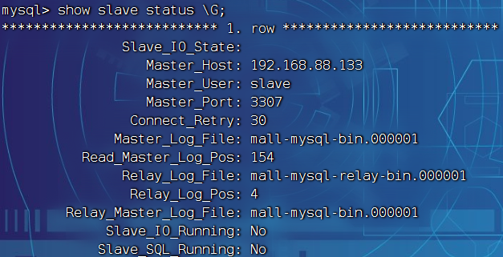

```sql
# 同步slave
start slave;
```

### 1.1.14再次查看从数据库同步状态

```sql
show slave status \G;
```

使用后：

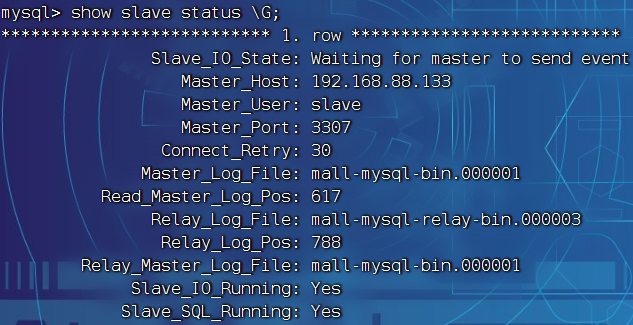


## 1.2安装redis集群

cluster(集群)模式-docker版哈希槽分区进行亿级数据存储

### 1.2.1面试题

#### 1.2.1.1问题
1~2亿条数据需要缓存，请问如何设计这个存储案例

#### 1.2.1.2分析

单机单台不可能，肯定时分布式存储，使用redis如何落地实现？

#### 1.2.1.3三种解决方案

##### 1.2.1.3.1哈希取余分区

 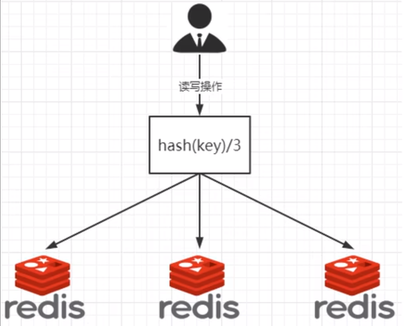

2亿条记录就是2亿个k:v，我们单机不行必须分布式多级，假设有3台及其构成集群，用户每次读写操作都是根据公示：hash(key)%N个机器台数，计算出哈希值，来决定映射到那个节点上

优点：简单粗暴，直接有效，只需预估好数据规划好节点，节能Boaz一段时间的数据支撑。使用Hash算法固定的一部分请求落在同一台服务器上，这样每台服务器固定处理一部分请求（并维护这些请求信息），起到负载均衡和分而治之的作用

缺点：原来规划好的节点，进行扩容或者缩容就会很麻烦，不扩缩，每次数据变动导致节点有变动，映射关系就需要重新计算，在服务器个数固定不变时没有问题，如果需要弹性扩容或者故障停机的情况下，原来的取模公式就会发生变动；Hash(key)/3变成Hash(key)?。此时地址经过某个redis及其宕机了，由于台数数量变化，会导致hash取余全部数据重新洗牌

##### 1.2.1.3.2一致性哈希算法分区

一致性哈希算法是在1997年有麻省理工学院提出的，设计目的是为了解决分布式缓存数据变动和映射问题，某个及其宕机了，分母改变了，自然取余就不行了

提出一致性Hash解决方案。目的时当服务器个数发生变动时，尽量减少影响客户端到服务器的映射关系

**三个步骤:**

- 算法构建一致性哈希环

> 一致性哈希算法必然有个hash函数并按照算法产生hash值，这个算法的所有可能哈希值会构成一个全量集，这个集合可以成为一个hash空间[0.2*32-1J，这个是一个线性空间，但是在算法中，我们通过适当的逻辑控制将它首尾相连(0=2'32),这样让它逻辑上形成了一个环形空间。
>
> 它也是按照使用取模的方法，前面笔记介绍的节点取模法是对节点（服务器）的数量进行取模。而一致性Hash算法是对2*'32取模，简单来说，一致性Hash算法将整个哈希值空间组织成一个虚拟的圆环，如假设某哈希函数H的值空间为0-2^32-1（即哈希值是一个32位无符号整形)，整个哈希环如下图:整个空间按顺时针方向组织，圆环的正上方的点代表O，O点右侧的第一个点代表1，以此类推，2、3、4、……直到2'32-1，也就是说O点左们的饿二个占伐书M99.1和A92.1在灭占由方向面合我们押这个由2M个占归术的国环称'Hach环

- 服务器IP节点映射

> 将汲取中各个IP节点映射到环上的某个位置
>
> 将各个服务器使用Hash进行一个哈希，集体可以选择服务器的IP或主机名作为关键字进行哈希，这样每台机器就能确定其在哈希环上的位置。假如4个节点NodeA,B,C,D,经过IP地址的哈希函数计算，使IP地址哈希后在换空间位置如下
>
> 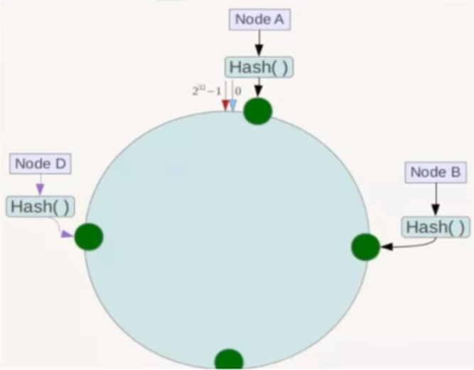

- key落到服务器的落键规则

> 当我们需要存储一个k:v键值对时，首先计算keyl的hash值，hash(key)将这个key使用相同的函数Hash计算出哈希值并确定此数据在环上的位置，从此位置沿环顺时针“行走”，第一台遇到的服务器就是其应该定位到的服务器，并将该键值对存储在该节点上。
>
> 如我们有Object A、Object B、Object C、Object D四个数据对象，经过哈希计算后，在环空间上的位置如下﹔根据一致性Hash算法，数据A会被定为到Node A上，B被定为到Node B上，C被定为到Node C上，D被定为到Node D上。
>
> 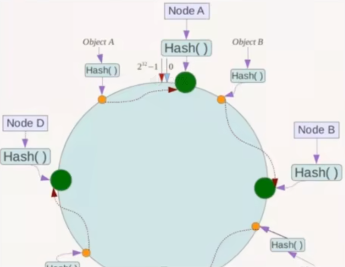

**优点：**

- 一致性哈希算法的容错性

> 假设Node C宕机，可以看到此时对象A、B、D不会受到影响，只有C对象被重定位到Node D。一般的，在一致性Hash算法中，如果一台服务器不可用，则受影响的数据仅仅是此服务器到其环空间中前一台服务器（即沿着逆时针方向行走遇到的第一台服务器）之间数据，其它不会受到影响。简单说，就是C挂了，受到影响的只是B、C之间的数据，并且这些数据会转移到D进行存储。
>
> 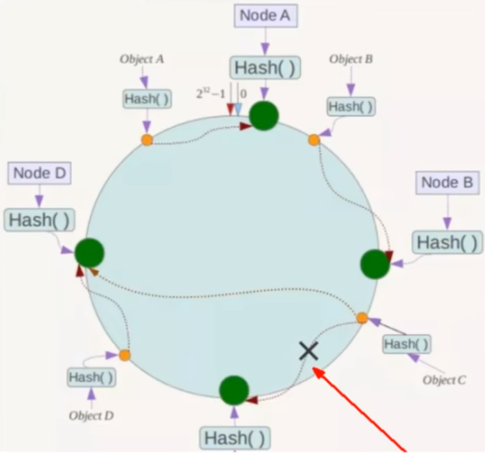

- 一致性哈希算法的扩展性

> 数据量增加了，需要增加一台节点NodeX，X的位置在A和B之间，那收到影响的也就是A到X之间的数据，重新把A到X的数据录入到X上即可，不会导致hash取余全部数据重新洗牌。
>
> 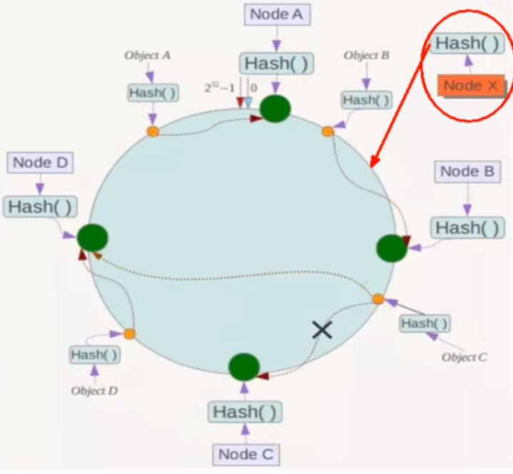

**缺点：**

一致性哈希算法数据倾斜问题

> 致性Hash算法在服务节点太少时，容易因为节点分布不均匀而造成数据倾斜（被缓存的对象大部分集中缓存在某一台服务器上:）问题，例如系统中只有两台服务器:
>
> 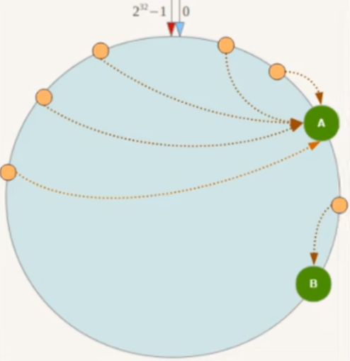


##### 1.2.1.3.3哈希槽分区

**为什么出现：**

> 哈希槽实质就是一个数据，数据[0,2^14-1]形成的hash slot空间

**能干什么：**

> 解决均匀分配的问题，在数据和节点之间又加入了一层，把这层称为哈希槽(slot)，用于管理数据和节点之间的关系，现在就相当于节点上放的是槽，槽里放的是数据。
>
> 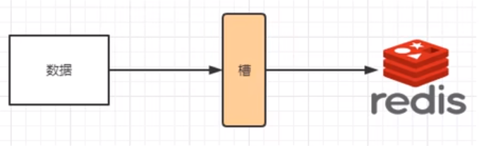
>
> 槽解决的时粒度问题，相当于把粒度放大了，这样便于数据移动
>
> 哈希解决的时映射问题，使用key的哈希值来计算所在的槽，便于数据分配

**多少个哈希槽**

> 一个集群只能有16384个槽，编号0-16383(0-2'14-1)。这些槽会分配给集群中的所有主节点，分配策略没有要求。可以指定哪些编号的槽分配给哪个主节点。集群会记录节点和槽的对应关系。解决了节点和槽的关系后，接下来就需要对key求哈希值，然后对16384取余，余数是几key就落入对应的槽里。slot = CRC16(key) % 16384。以槽为单位移动数据，因为槽的数目是固定的，处理起来比较容易，这样数据移动问题就解决了。

**哈希槽的计算**

> Redis集群中内置了16384个哈希槽，redis会根据节点数量大致均等的将哈希槽映射到不同的节点。当需要在Redis集群中放置一个key-valuel时,redis 先对 key使用crc16算法算出一个结果，然后把结果对16384求余数，这样每个key都会对应一个编号在0-16383之间的哈希槽，也就是映射到某个节点上。如下代码，key之A、B在Node2，key之C落在Node3上
>
> 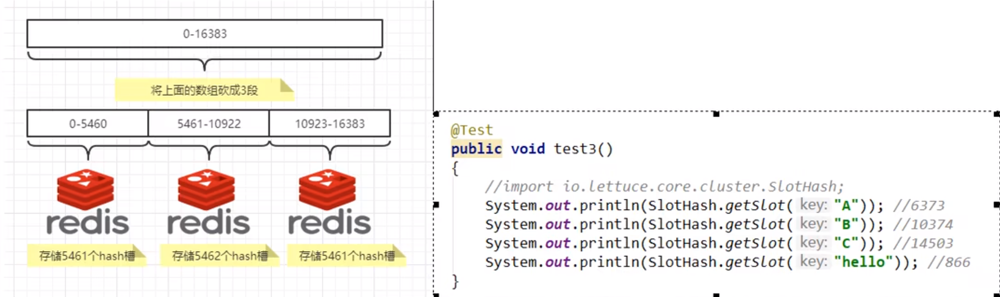

### 1.2.2三主三从redis集群扩缩容配置案例说明

 #### 1.2.2.1三主三从redis集群配置

##### 1.2.2.1.1关闭防火墙，启动docker后台服务

```shell
systemctl stop firewalld
systenctl start docker
```

##### 1.2.2.1.2新建6个docker容器实例

```shell
docker run -d --name redis-node-1 --net host --privileged=true -v/sgming/redis/share/redis-node-1:/data redis:6.2.6 --cluster-enabled yes --appendonly yes --port 6381

docker run -d --name redis-node-2 --net host --privileged=true -v/sgming/redis/share/redis-node-2:/data redis:6.2.6 --cluster-enabled yes --appendonly yes --port 6382

docker run -d --name redis-node-3 --net host --privileged=true -v/sgming/redis/share/redis-node-3:/data redis:6.2.6 --cluster-enabled yes --appendonly yes --port 6383

docker run -d --name redis-node-4 --net host --privileged=true -v/sgming/redis/share/redis-node-4:/data redis:6.2.6 --cluster-enabled yes --appendonly yes --port 6384

docker run -d --name redis-node-5 --net host --privileged=true -v/sgming/redis/share/redis-node-5:/data redis:6.2.6 --cluster-enabled yes --appendonly yes --port 6385

docker run -d --name redis-node-6 --net host --privileged=true -v/sgming/redis/share/redis-node-6:/data redis:6.2.6 --cluster-enabled yes --appendonly yes --port 6386
```

> docekr run：创建并运行容器实例
>
> --name redis-node-6：容器名字
>
> --net host：使用宿主机的ip和端口，默认
>
> --privileged=true：获取宿主机的权限
>
> -v /sgming/redis/share/redis-node-1:/data：数据卷挂载
>
> redis:6.2.6：redis镜像
>
> --cluster-enabled yes：开启redis集群
>
> --appendonly yes：开启持久化
>
> --port  6386：redis端口

##### 1.2.2.1.3进入容器redis-node-1并为6台及其构建集群关系

```shell
docker exec -it redis-node-1 /bin/bash 
```

**构建主从关系：**

```shell
redis-cli --cluster create 192.168.88.133:6381 192.168.88.133:6382 192.168.88.133:6383 192.168.88.133:6384 192.168.88.133:6385 192.168.88.133:6386 --cluster-replicas 1
```

> 192.168.88.133:6381：宿主机地址和对应的端口
>
> --cluster-replicas 1：为每个master创建要给slave节点

然后yes

##### 1.2.2.1.4链接进入6381作为切入点，查看集群状态

```shell
redis-cli -p 6381
cluster info
cluster nodes
```

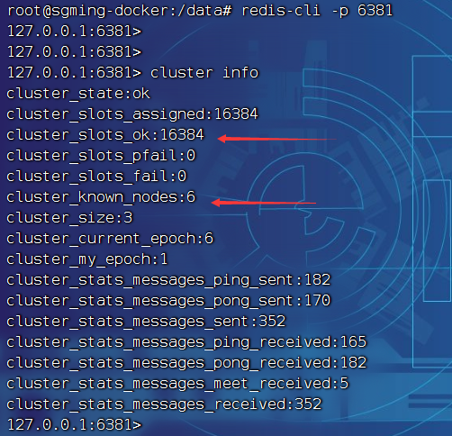

#### 1.2.2.2主从容错切换迁移案例

##### 1.2.2.2.1数据读写存储

```shell
docker exec -it redis-node-1 /bin/bash
```

不要使用下面的方式进入redis

```shell
# 错误的方式
redis-cli -p 6381
# 正确的方式
redis-cli -p 6381 -c
```

> 这时候我不能直接存储键值对，因为我们是集群了，应该使用集群的方式

**查看集群信息**

```shell
redis-cli --cluster check 192.168.88.133:6381
```

##### 1.2.2.2.2容错切换迁移

主6381和从机切换，先停止6381

```shell
# 停止容器
docker stop redis-node-1
# 进入二号节点
docker exec -it redis-node-2 /bin/bash
# 集群方式进入redis
redis-cli -p 6382 -c
# 查看集群状态
cluster nodes
```

重启6381后，他会变成以前从机的从机

#### 1.2.2.3主从扩容

##### 1.2.2.3.1新建6387，6388两个节点，启动，查看是否是8个节点

```shell
docker run -d --name redis-node-7 --net host --privileged -v /sgming/redis/share/redis-node-7:/data redis:6.2.6 --cluster-enabled yes --appendonly yes --port 6387

docker run -d --name redis-node-8 --net host --privileged -v /sgming/redis/share/redis-node-8:/data redis:6.2.6 --cluster-enabled yes --appendonly yes --port 6388
```

##### 1.2.2.3.2进入node-7实例内部

```shell
docker exec -it redis-node-7 /bin/bash
```

##### 1.2.2.3.3把node-7作为master节点加入集群

```shell
redis-cli --cluster add-node [自己真实IP]:[master端口] [自己真实IP]:[领路人端口]
# 例如
redis-cli --cluster add-node 192.168.88.133:6387 192.168.88.133:6381
```

> 领路人端口：就是原来集群节点的领路人

##### 1.2.2.3.4查看集群情况第一次

```shell
redis-cli --cluster check 192.168.88.133:6381
```

##### 1.2.2.3.5重新分配槽位

```shell
redis-cli --cluster reshard IP:端口
# 例如
redis-cli --cluster reshard 192.168.88.133:6381
```

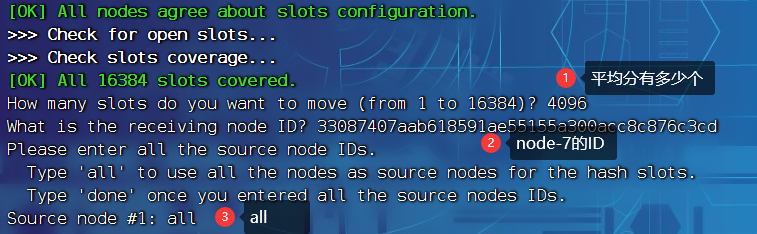

##### 1.2.2.3.5查看集群情况第二次

```shell
redis-cli --cluster check 192.168.88.133:6381
```

槽号分派说明

- 为什么6387是3个新的区间，
- 重新分配的成本太高，所以前3个master各自匀出来一部分，给新节点

##### 1.2.2.3.6为node-7分配从节点node-8

```shell
redis-cli --cluster add-node IP:[slave端口] IP:[master端口] --cluster-slave --cluster-master-id [master的ID]
# 例如
redis-cli --cluster add-node 192.168.88.133:6388 192.168.88.133:6387 --cluster-slave --cluster-master-id 33087407aab618591ae55155a300acc8c876c3cd
```

##### 1.2.2.3.5查看集群情况第三次

```shell
redis-cli --cluster check 192.168.88.133:6381
```

#### 1.2.2.4主从缩容

注意：先删除从机在删除主机

##### 1.2.2.4.1获取node-7和node-8两个节点的ID

 ```shell
 redis-cli --cluster check 192.168.88.133:6381
 ```

##### 1.2.2.4.2将node-8删除

```shell
redis-cli --cluster del-node ip:[从机端口] [从机ID]
# 例如
redis-cli --cluster del-node 192.168.88.133:6388 de92e8bc2b2be5908eb94d400f33c2188a1b80f8
# 删除后查看
redis-cli --cluster check 192.168.88.133:6381
```

##### 1.2.2.4.3重新分配槽号

```shell
redis-cli --cluster reshard IP:端口
# 例如
redis-cli --cluster reshard 192.168.88.133:6381
```

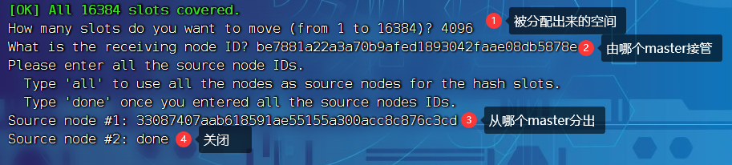

```shell
# 再次查看是否成功
redis-cli --cluster check 192.168.88.133:6381
```

##### 1.2.2.4.4删除node-7

```shell
redis-cli --cluster del-node ip:[从机端口] [从机ID]
# 例如
redis-cli --cluster del-node 192.168.88.133:6387 33087407aab618591ae55155a300acc8c876c3cd
# 查看是否删除成功
redis-cli --cluster check 192.168.88.133:6381
```

# 2.DockerFile解析

## 2.1是什么

DockerFile是用来构建Docker镜像的文本文件，是由一条条构建镜像所需指令和参数构成的脚本

### 2.1.1概述

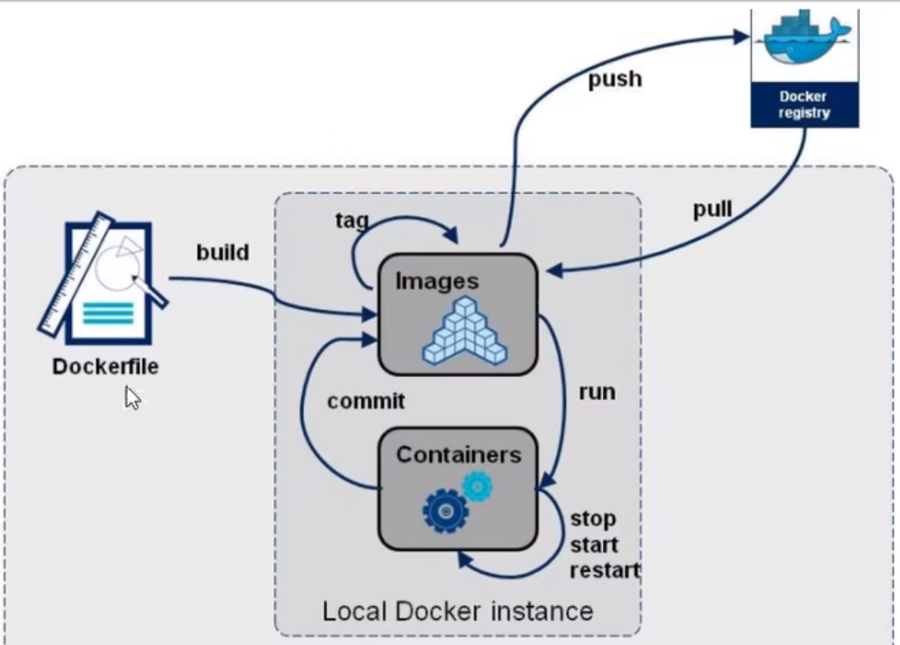

### 2.1.2官网

https://docs.docker.com/engine/reference/builder/

### 2.1.3构建三步骤

#### 2.1.3.1编写DockerFile文件

#### 2.1.3.2docker build命令构建镜像

#### 2.1.3.3docker fun 依镜像运行容器实例

## 2.2DockerFile构建过程解析

### 2.2.1DockerFile内容基础知识

- 每条保留字指令都必须为大写字母且后面要跟随至少一个参数
- 指令按照从上到下，顺序执行
- #表示注解
- 每条指令都会创建要给新的镜像层并对镜像机械能提交

### 2.2.2Docker执行DocekrFile的大致流程

- docker从基础镜像运行一个容器
- 执行一条指令并对容器做出修改
- 执行类似docker commit的操作提交一个新的镜像
- docker在基于刚提交的镜像运行一个新容器
- 执行dockerfile中的下一条指令直到所有指令都执行完

### 2.2.3小总结

从应用软件 的角度来看，DockerFile、Docker镜像与Docker容器分别代表软件的三个不同阶段

- DockerFile是软件的原材料
- Docker镜像是软件的交付品
- Docekr容器则可以认为是软件镜像的运行态，即依照镜像运行的容器实例

DockerFile面向开发，Docker镜像成为交付标准，Docker容器则涉及部署和运维，三者缺一不可，合力充实Docker体系的基石

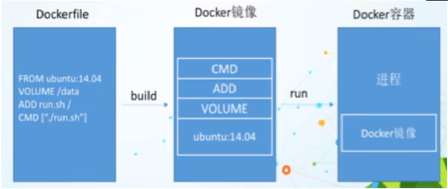

- DockerFile，需要定义一个DcoekrFile，DocekrFile定义了进程需要的一切东西，DockerFile涉及的内容包括执行代码或者是文件、环境变量、依赖包、运行时环境、动态链接库、操作系统的发行版、服务进程和内核进程（当应该用进程需要和系统服务和内核进程打交道，这时需要考虑如何设计namespace的权限控制）等等
- Docker镜像，在用DockerFile定义一个文件后，docekr build时会产生一个Docker镜像，当运行Docker镜像时会真正开始提供服务。
- Docker容器，容器时直接提供服务的。

## 2.3DockerFile常用保留字指令

### 2.3.1FROM

基础镜像，当前新镜像是基于哪个镜像的，指定一个已经存在的镜像作为模板，第一条必须是from

### 2.3.2MAINTAINER

镜像维护者的姓名和邮箱地址

### 2.3.3RUN

#### 2.3.3.1容器构建的时候运行的命令

#### 2.3.3.2两种格式

- shell格式

> RUN <命令行命令>
>
> <命令行命令>等同于，在终端操作shell命令

- exec格式

> RUN ["可执行文件", "参数1", "参数2"]
>
> 例如：
>
> RUN ["./test/php", "dev", "fooline"]等价于 RUN ./test.php dev offline

#### 2.3.3.3RUN是在docker build时运行

###  2.3.4EXPOSE

容器对外暴露的端口

### 2.3.5WORKDIR

指定在创建容器后，终端默认登录的进来工作的目录，一个落脚点

### 2.3.6USER

指定该镜像以什么阳的用户去执行，如果都不执行，默认是root

### 2.3.7ENV

用来在构建镜像过程中设置环境变量

```
ENV MY_PATH/usr/mytest

WORKDIR $MY_PATH
```

> 这个环境变量（）可以在后续的任何RUN指令中使用，这就如同指令前面制定了环境变量前缀一样；也可以在其他指令中直接使用这些环境变量

### 2.3.8VOLUME

容器数据卷，用于数据保存和持久化工作

### 2.3.9ADD

将宿主机目录下的文件拷贝进镜像并且自动处理RUL和解压tar压缩包

### 2.3.10COPY

类型ADD，拷贝文件和目录到镜像中

将从构建上下文目录中<源路径>的文件/目录复制到新的一层的镜像内的<目标路径>位置

- COPY src dest
- COPY ["scr", "dest"]
- <src源路径>:源文件或者源目录
- <dest目标路径>:容器内指定路径，该路径不用事先建好， 该路径不存在的话，会自动创建

### 2.3.11CMD

#### 2.3.11.1指定容器启动后要干的事情

CMD容器启动命令

`CMD`指令的格式和`RUN`相似，也是两个格式：

- `shell`格式:`CMM<命令>`
- `exec`格式:`CMD ["可执行文件", "参数1", "参数2"...]`
- 参数列表格式：`CMD ["可执行文件", "参数1", "参数2"...]`,在指定`ENTRYPOINT`指令后，用`CMD`指定具体的参数

#### 2.3.11.2注意

- DockerFile中可以有多个CMD指令，但只有最后一个生效，CMD会被docker run之后的参数替换

- 参考官方Tomcat的dockerfile演示讲解

```
# 官网最后一行命令
EXPOSE 8080
CMD ["catalina.sh", "run"]
```

- 覆盖操作

```
docker run -it -p 8080:8080 镜像ID /bin/bash
# /bin/bash会覆盖CMD ["catalina.sh", "run"] 中的catalina.sh这个参数
```

#### 2.3.11.3和前面RUN命令的区别

CMD是在docker run时运行

RUN是在docker build时运行

### 2.3.12ENTRYPOINT

用于指定一个容器启动时要运行的命令

类似于CMD指令，但是ENTRYPOINT不会被docker run后面的命令覆盖，而且这些命令行参数会被当作参数送给ENTRYPOINT指令指定的程序

命令格式和案例说明

> 命令格式：ENTRYPOINT ["<executeable>", "<param1>", "<param2>", ...]
>
> ENTRYPOINT可以和CMD一起用，一般变参才会使用CMD，这里的CMD等于是给ENTRYPOINT传参，当指定了ENTRYPOINT后，CMD的含义就会发生变化，不再是直接运行其命令而是将CMD的内容作为参数传递给ENTRYPOINT指令，他两个组合变成<ENTRYPOINT>"<CMD>"
>
> 案例如下：假设已通过DockerFile构建了nginx:test镜像
>
> ```
> FROM nginx
> ENTRYPOINT ["nginx", "-c"] # 定参
> CMD ["/etc/nginx/nginx.conf"] # 变参
> ```
>
> 上下对应
>
> | 是否传参       | 按照dockerfile编写执行         | 传参运行                                     |
> | -------------- | ------------------------------ | -------------------------------------------- |
> | docker         | docker run nginx:test          | docker run nginx:test -c /etc/nginx/new.conf |
> | 衍生的实际命令 | nginx -c /etc/nginx/nginx.conf | nginx -c /etc/nginx/new.conf                 |
>
> 

## 2.4案例

### 2.4.1自定义镜像mycentosjava8

#### 2.4.1.1要求

- Centos7镜像具备vim+config+jdk8
- JDK的下载镜像地址
  - https://mirrors.yangxingzhen.com/jdk

#### 2.4.1.2编写

把jdk放在一个文件夹下

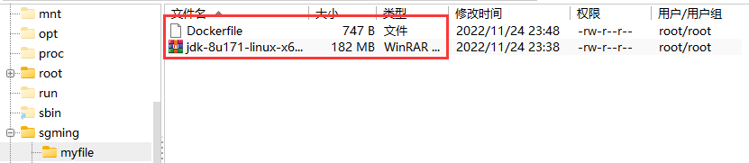

添加Dockerfile，和jdk同一级

```shell
vim Dockerfile
```

文件内容

```tex
FROM centos:7.6.1810
MAINTAINER sgming<2890697746@qq.com>

ENV MYPATH /usr/locl
WORKDIR $MYPATH

#安装vim编辑器
RUN yum -y install vim
#安装ifconfig命令
RUN yum -y install net-tools
#安装java8及lib库
RUN yum -y install glibc.i686
RUN mkdir /usr/local/java

#ADD是相对路径jar，把jdk-8u171-linux-x64.tar.gz添加到容器，安装包必须和Dockerfile文件在同一个位置
#文件和对应的jdk的文件名相同
ADD jdk-8u171-linux-x64.tar.gz /usr/local/java/

#配置java环境
ENV JAVA_HOME /usr/local/java/jdk1.8.0_171
ENV JRE_HOME $JAVA_HOME/jre
ENV CLASSPATH $JAVA_HOME/lib/dt.jar:$JAVA_HOME/lib/tools.jar:$JRE_HOME/lib:$CLASSPATH
ENV PATH $JAVA_HOME/bin:$PATH

EXPOSE 80

CMD echo $MYPATH
CMD echo "success--------ok"
CMD /bin/bash
```

#### 2.4.1.3构建

```shell
docker build -t 镜像名字:TAG .
# 例如
docker build -t centosjava8:1.5 .
```

**注意：**

如果执行后报：[Warning] IPv4 forwarding is disabled. Networking will not work.

```shell
# 宿主机执行
echo "net.ipv4.ip_forward=1" >>/usr/lib/sysctl.d/00-system.conf
# 重启服务
systemctl restart network && systemctl restart docker
```

**验证**

```shell
docker images
docker run -it [镜像ID] /bin/bash
```

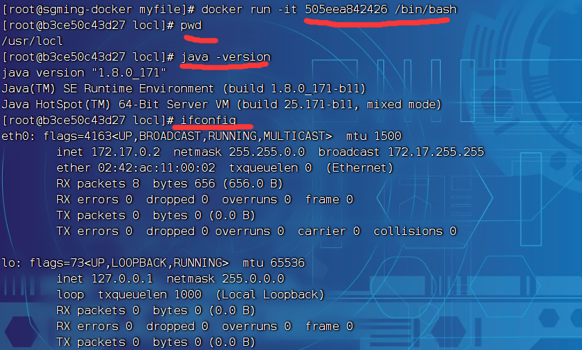

### 2.4.2虚悬镜像

REPOSITORY和TAG都为<none>的镜像叫虚悬镜像

查看虚悬镜像

```shell
docker image ls -f dangling=true
```

删除虚悬镜像

```shell
docker image prune
```


# 3.Docker微服务实战

## 3.1通过IDEA新建一个普通微服务模块

### 3.1.1对项目模块通过maven打包(package)成一个jar包

## 3.2通过dockerfile发布微服务部署到docker容器

### 3.2.1创建Dockerfile和jar包同一级

### 3.2.2编写Dockerfile文件

```shell
# 基础镜像使用java
FROM java:8
MAINTAINER SGMing
VOLUME /tmp
ADD docker-1.0-SNAPSHOT.jar sgming_docker.jar
# 运行jar包
RUN bash -c 'touch /sgming_docker.jar'
ENTRYPOINT ["java", "-jar", "/sgming_docker.jar"]
EXPOSE 8080
```

### 3.2.3构建镜像

```shell
docker build -t sgming_docker:1.6 .
```

### 3.2.4查看运行镜像

```shell
docker images
docker run -d -p 8080:8080 [镜像ID]
```


# 4.Docker网络

## 4.1是什么

### 4.1.1docker不启动，默认网络情况

```shell
systemctl stop docker
ip addr
```

- ens33
- lo：localhost 本地回环链路
- virbr0

> 在CentOS7的安装过程中如果有选择相关虚拟化的的服务安装系统后，启动网卡时会发现有一个以网桥连接的私网地址的virbrO网卡(vibr0网卡:它还有一个固定的默认IP地址192.168.122.1)，是做虚拟机网桥的使用的，其作用是为连接其上的虚机网卡提供NAT访问外网的功能。

### 4.1.2docker启动，网络情况

```shell
systemctl start docker
ip addr
```

## 4.2常用基础命令

### 4.2.1查看网络

```shell
docker network ls
```

### 4.2.2查看网络源数据

```shell
docker network inspect XXX网络名字
```

### 4.2.3删除网络

```shell
docker network rm XXX网络名字
```

## 4.3能干什么

容器间的互联和通信以及端口映射

容器IP变动时候可以通过服务名直接网络通信而不受到影响

### 4.4网络模式

### 4.4.1总体介绍

| 网络模式  | 简介                                                         |
| --------- | ------------------------------------------------------------ |
| bridge    | 为每个容器分配、设置IP等，并将容器连接到`docker0`，虚拟网桥，默认为该模式 |
| host      | 容器将不会虚拟出自己的网卡，配置自己的IP等，而是使用宿主机的IP和端口 |
| none      | 容器有独立Network namespace，但并没有对其进行任何网络设置，如分配veth pair和网络桥连接，IP等 |
| container | 新创建的容器不会创建自己的网卡和配置自己的IP，而是和一个指定的容器共享IP端口范围等。 |

- bridge模式：使用--network bridge指定，默认使用docker0
- host模式：使用--network host指定
- none模式：使用--network none指定
- container模式：使用--network container:NAME或者容器ID指定

### 4.4.2容器实例内默认网络IP生产规则

```shell
docker run -it --name u1 ubuntu /bin/bash
# ctrl + p + q退出出来
docker run -it --name u2 ubuntu /bin/bash
# catl + p + q退出查看u1的IP
docker inspect u1:tail -n 20
# 查看u2的IP
docker inspect u2:tail -n 20
# 删除u2
docker rm -f u2
# 新建容器u3
docker run -it --name u3 ubuntu /bin/bash
# ctrl + p + q退出产看u3的IP
docker inspect u3:tail -n 20
```

### 4.4.3案例说明

#### 4.4.3.1bridge

##### 4.4.3.1.1是什么

```shell
docker network inspect bridge
```

Docker服务默认会创建一个dockerO网桥（其上有一个dockerO内部接口)，该桥接网络的名称为dockerO，它在内核层连通了其他的物理或虚拟网卡，这就将所有容器和本地主机都放到同一个物理网络。Docker默认指定了dockerO接口的IlP地址和子网掩码，让主机和容器之间可以通过网桥相互通信。


查看你bridge网络详细信息，通过grep获取名称项

```shell
docker network inspect bridge | grep name

ifconfig
```

##### 4.4.3.1.2案例

**说明：**

- Docker使用Linux桥接，在宿主机虚拟一个Docker容器网桥(docker)，Docker启动一个容器时会根据Docker网桥的网段分配给容器一个IP地址，称为Container-P，同时Docker网桥是每个容器的默认网关。因为在同一宿主机内的容器都按入同一个网桥，这样容器之间就能够通过容器的Container-lP直接通信。
- docker un的时候，没有指定network的话默认使用的网桥模式就是bridge，使用的就是dockerO。在宿主机ifconfig,就可以看到dockerO和自己createi的network(后面讲)eth0, eth1，eth2……代表网卡一，网卡二，网卡三…… lo代表127.0.0.1，即localost. inet addr用来表示网卡的IP地址
- 网桥docker0创建一对对等虚拟设备接口一个叫veth，另一个叫eth0，成对匹配。

> 整个宿主机的网桥模式都是docker0，类似的一个交换机有一堆接口，每个接口叫veth，在本地主机和容器内分别创建一个虚拟接口，并让他们彼此联通（这样的一对接口叫veth pair）
>
> 每个容器实例内部都有一块网卡，每个接口叫eth0
>
> docker0上面的每个veth匹配某个容器实例内部eth0，两两配对，一一匹配。
>
> 通过上述，将宿主机上所有容器都连接到这个内部网络上，两个容器在同一个网络下，会从一个网关下各自拿到分配的IP，此时两个容器的网络是互通的
>
> 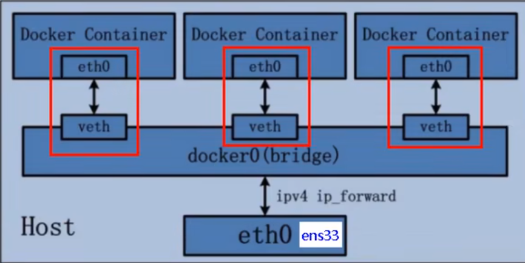

**代码：**

```shell
docker run -d -p 8081:8080 -name tomcat81 billygoo/tomcat8-jdk8

docker run -d -p 8082:8080 -name tomcat82 billygoo/tomcat8-jdk8
# 宿主机查看
ip addr
# tomcat81查看
ip addr
```

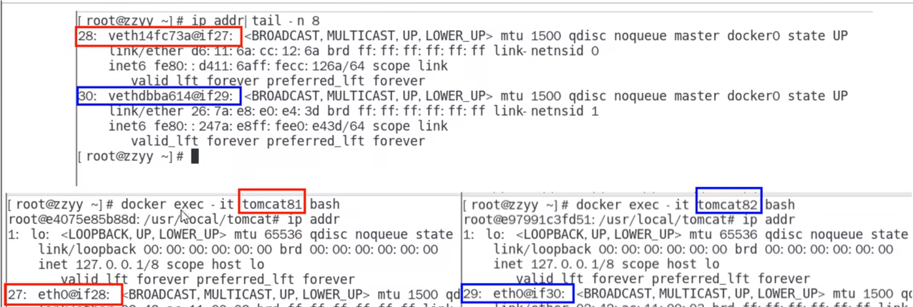

#### 4.4.3.2host

##### 4.4.3.2.1是什么

 直接使用宿主机的IP地址与外界进行通信，不再需要额外的NAT转换

##### 4.4.3.2.1案例

**说明：**

容器将不在会获得一个独立的Network Namespace，而是和宿主机公用一个Netwrok Namespace，容器将不会虚拟出直接的网卡而是使用宿主机的IP和端口

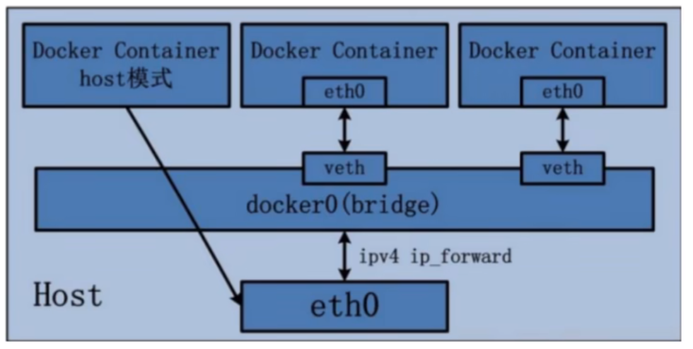

**代码**

- 警告

```shell
docker run -d -p 8083:8080 --network host --name tomcat83 billygoo/tomcat8-jdk8
```

> 问题：docker启动时总是遇见标签中的警告
>
> 原因：docker启动时指定**--network=host**，如果还制定了-p映射端口，那这个时候就会有警告，并且通过-p设置的参数将不会起任何作用，端口会以主机端口为主，重复时侧递增
>
> 解决：解决方法就是使用docker的其他网络模式，例如**--network=bridge**，这样问题就解决了，或者直接无视。。

- 正确

```shell
docker run -d --network host --name tomcat83 billygoo/tomcat8-jdk8
```

**查看容器内部**

```shell
# 83
docker inspect tomcat83:tail -n 20
# 
docker inspect tomcat81:tail -n 20
```

**没有设置-p，如何访问**

宿主机IP:8080

#### 4.4.3.3none

##### 4.4.3.3.1是什么

禁用网络功能，只有lo标识（就是本地回环）

##### 4.4.3.3.2案例

 ```shell
 docker run -d -p 8084:8080 --network none --name tomcat84 billygoo/tomcat8-jdk8
 # 查看
 docker inspect tomcat84:tail -n 20
 # 容器内查看
 docker exec -it tomcat84 bash
 ip addr
 ```

#### 4.4.3.4container

##### 4.4.3.4.1是什么

container网络模式：新建的容器和已经存在的一个容器共享一个网络ip配置而不是和宿主机共享。新创建的容器不会创建自己的网卡，配置自己的IP，而是和一个指定的容器共享iP、端口范围等。同样，两个容器除了网络方面，其他的如文件系统、进程列表等还是隔离的。

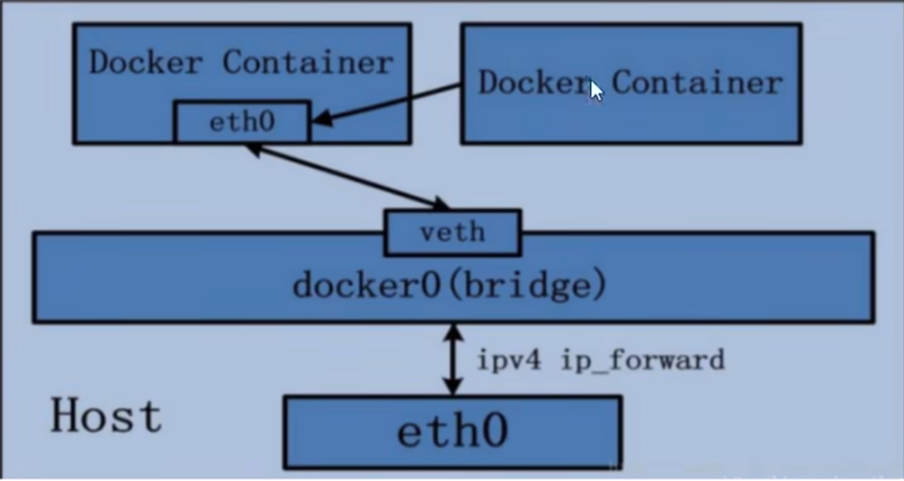

##### 4.4.3.4.2错误案例

```shell
#1
docker run -d -p 8085:8080 --name tomcat85 billygoo/tomcat8-jdk8
#2
docker run -d -p 8086:8080 --network container:tomcat85 --name tomcat86 billygoo/tomcat8-jdk8
```

> 相当于tomcat86和tomcat85公用一个ip同一个端口，导致端口冲突

##### 4.4.3.4.3正确案例

**Alpine**

Alpine Linux 是一款独立的、非商业的通用Linux发行版，专为追求安全性、简单性和资源效率的用户而设计。可能很多人没听说过这个Linux发行版本，但是经常用Docker的朋友可能都用过，因为他小，简单，安全而著称，所以作为基础镜像是非常好的一个选择，可谓是麻雀虽小但五脏俱全，镜像非常小巧，不到6M的大小，所以特别适合容器打包。

**代码**

```shell
docker run -it --name alpine1 pine1alpine /bin/sh
# alpine2使用alpine1的net
docker run -it --network container:alpine1 --name alpine2 alpine /bin/sh
```

**验证**

```shell
# alpine1中
ip addr
# alpine2中
ip addr
```

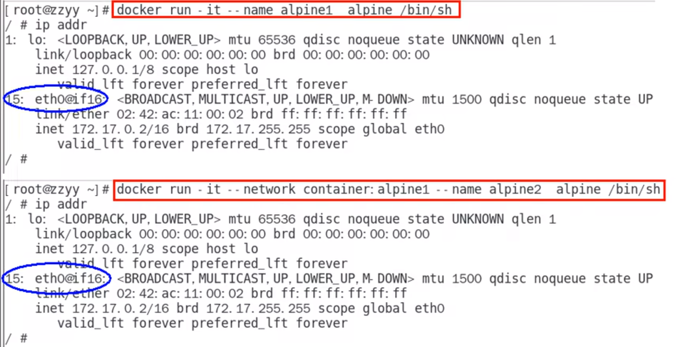

**关闭alpine1查看alpine2只有一个lo本地回环链路了**

#### 4.4.3.5自定义网络模式

##### 4.4.3.5.1没有使用自定义网络之前案例

之前执行过的两个容器

```shell
docker run -d -p 8081:8080 -name tomcat81 billygoo/tomcat8-jdk8

docker run -d -p 8082:8080 -name tomcat82 billygoo/tomcat8-jdk8
```

问题：

- 按照IP地址，是否可以ping通

> 是可以ping通

- 按照服务名，是否可以ping通

```shell
# 在81容器中
ping tomcat82
# 在82容器中
ping tomcat81
```

> 不可以ping通


##### 4.4.3.5.2使用自定义网络之后案例

**新建自定义网络**

```shell
# 查看所有网络
docker network ls
# 新建
docker network create sgming_network
```

**新建容器加入新建的自定义网络**

```shell
docker run -d -p 8081:8080 --network sgming_network -name tomcat81 billygoo/tomcat8-jdk8

docker run -d -p 8082:8080 --network sgming_network -name tomcat82 billygoo/tomcat8-jdk8
```

互相ping

```shell
# 在81容器中
docker exec -it tomcat81 bash
ping tomcat82
# 在82容器中
docker exec -it tomcat81 bash
ping tomcat81
```

# 5.Docker-compose容器编排

Docker-Compose是Docker官方的开源项目，负责实现对Docker容器集群的快速编排

Compose 是 Docker公司推出的一个工具软件，可以管理多个Docker容器组成一个应用。你需要定义一个YAML格式的配置文件docker-compose.yml，写好多个容器之间的调用关系。然后，只要一个命令，就能同时启动/关闭这些容器

## 5.1能干什么

- docker建议我们每一个容器中只运行一个服务,因为docker容器本身占用资源极少,所以最好是将每个服务单独的分割开来但是这样我们又面临了一个问题?
- 如果我需要同时部署好多个服务,难道要每个服务单独写Dockerfle然后在构建镜像,构建容器,这样累都累死了,所以docker官方给我们提供了docker-compose多服务部署的工具
- 例如要实现一个Web微服务项目，除了Web服务容器本身，往往还需要再加上后端的数据库mysql服务容器，redis服务器，注册中心eureka，甚至还包括负载均衡容器等等
- Compose允许用户通过一个单独的docker-compose.yml模板文件（YAML格式)来定义一组相关联的应用容器为一个项目(project)。
- 可以很容易地用一个配置文件定义一个多容器的应用，然后使用一条指令安装这个应用的所有依赖，完成构建。Docker-Compose解决了容器与容器之间如何管理编排的问题。

## 5.2下载按照

### 5.2.1官网

 https://docs.docker.com/compose/compose-file/compose-file-v3/

### 5.2.2官网下载

[Install the Compose standalone | Docker Documentation](https://docs.docker.com/compose/install/other/)

### 5.2.3安装步骤

```shell
# github
curl -SL https://github.com/docker/compose/releases/download/v2.13.0/docker-compose-linux-x86_64 -o /usr/local/bin/docker-compose
# daocloud 快
curl -L https://get.daocloud.io/docker/compose/releases/download/v2.13.0/docker-compose-`uname -s`-`uname -m` -o /usr/local/bin/docker-compose
# 给可执行权限
chmod +x /usr/local/bin/docker-compose
# 查看是否安装成功
docker-compose --version
```

## 5.2Compose核心概念

### 5.2.1一个文件

docker-compose.yml

### 5.2.2连个要素

#### 5.2.2.1服务（service）

一个个应用容器实例，比如订单微服务，库存微服务，mysql容器，nginx容器或者redis容器

#### 5.2.2.2工程（project）

由一组关联的应用容器组成的一个完整业务单元，在docker-compose.yml文件定义


## 5.3Compose使用的三个步骤

- 编写Dockerfile定义各个微服务应用并构建出对应的镜像文件
- 使用docker-compose.yml，定义一个完整的业务单元，安排好整体应用中各个容器服务
- 最后，执行docker-compose up命令，来启动并运行整个应用程序，完成一键部署上线

## 5.4Compose常用命令

| 命令                          | 说明                                         |
| ----------------------------- | -------------------------------------------- |
| docker-compose -h             | 查看帮助                                     |
| docker-compose up             | 启动所有docker-compose服务                   |
| docker-compose up -d          | 启动所有docker-compose服务并后台与运行       |
| docker-compose down           | 停止并删除容器，网络，卷，镜像               |
| docker-compose exec yml服务ID | 进入容器实例内部记得加 /bin/bash             |
| dcoker-compose ps             | 展示当前docker-compose编排过的运行的所有容器 |
| docker-compose top            | 展示当前docker-compose编排过的容器进程       |
| docker-compose logs yml服务ID | 查看容器的输出日志                           |
| dcoker-compose config         | 检查配置                                     |
| docker-compose config -q      | 检查配置，有问题才输出                       |
| docker-compose start          | 启动服务                                     |
| docker-compose restart        | 重启服务                                     |
| docker-compose stop           | 停止服务                                     |


## 5.5不使用Compose编排微服务

### 5.5.1打包项目

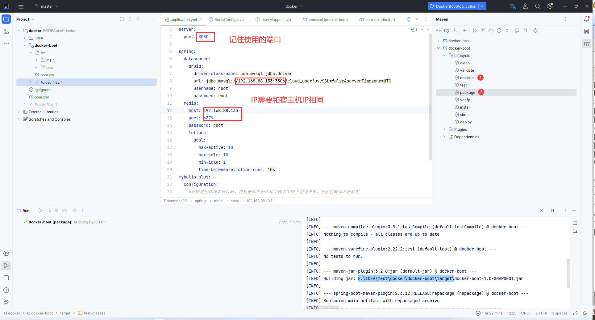

### 5.5.2将jar文件放到宿主机的一个文件夹下

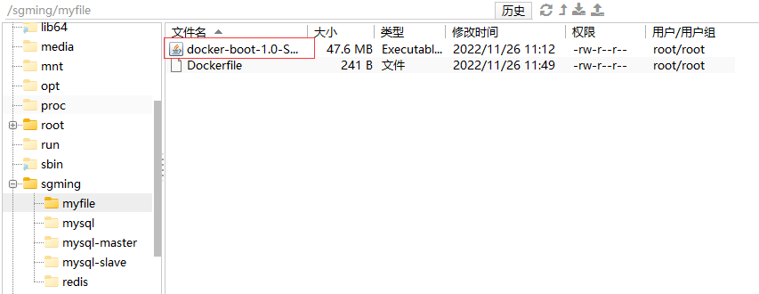

### 5.5.3编写Dockerfile

```tex
# 基础镜像使用java
FROM java:8
MAINTAINER SGMing
VOLUME /tmp
ADD docker-boot-1.0-SNAPSHOT.jar sgming_docker.jar
# 运行jar包
RUN bash -c 'touch /sgming_docker.jar'
ENTRYPOINT ["java", "-jar", "/sgming_docker.jar"]
EXPOSE 8080
```

> EXPOSE 8080:使用你项目的端口

```shell
docker build -t sgming_docker:1.6 .
```


### 5.5.4运行一个mysql容器

```shell
docker run -d -p 3306:3306 --privileged=true -v /sgming/mysql/log:/var/log/mysql -v /sgming/mysql/data:/var/lib/mysql -v /sgming/mysql/conf:/etc/mysql/conf.d -e MYSQL_ROOT_PASSWORD=root --name mysql57 mysql:5.7
```

注意中文乱码问题:

**在/sgming/mysql/conf下新建my.cnf文件，然后添加**

```tex
[client]
default_character_set=utf8
[mysqld]
collation_server=utf8_general_ci
character_set_server=utf8
```

### 5.5.5运行一个redis容器

复制配置文件

​	将redis的配置文件`redis.conf`复制到`/sgming/redis/redis.conf`

修改配置文件

- (60)注释`bind 127.0.0.1`
- (94)设置protected-mode no

- (257)设置daemonize no

运行镜像

```shell
docker run -p6379:6379 --name redis6 --privileged=true -v /sgming/redis/redis.conf:/etc/redis/redis.conf -v /sgming/redis/data:/data -d redis:6.0.8 redis-server /etc/redis/redis.conf
```

### 5.5.6运行项目镜像

```shell
docker run --name docker-sgming -d -p 8080:8080 [镜像ID]
```


## 5.6使用Compose编排微服务

### 5.6.1编写docker-compose.yml

```tex
version: "3"
services:
  microService:
    image: sgming_docker:1.6
    container_name: ms01
    ports:
      - "8080:8080"
    volumes:
      - /sgming/microService:/data
    networks:
      - sgming_net
    depends_on:
      - redis
      - mysql

  redis:
    image: redis:6.2.6
    ports:
      - "6379:6379"
    volumes:
      - /sgming/redis/redis.conf:/etc/redis/redis.conf
      - /sgming/redis/data:/data
    networks:
      - sgming_net
    command: redis-server /etc/redis/redis.conf
    
  mysql:
    image: mysql:5.7
    environment:
      MYSQL_ROOT_PASSWORD: 'root'
      MYSQL_ALLOW_EMPTY_PASSWORD: 'no'
      MYSQL_DATABASE: 'cloud_user'
      MYSQL_USER: 'root'
      MYSQL_PASSWORD: 'root'
    ports:
      - "3306:3306"
    volumes:
      - /sgming/mysql/data:/var/lib/mysql
      - /sgming/mysql/conf/my.cnf:/etc/my.cnf
      - /sgming/mysql/init:/docker-entrypoint-initdb.d
    networks:
      - sgming_net
    command: --default-authentication-plugin=mysql_native_password
    
networks:
  sgming_net:
```

### 5.6.2修改项目配置文件

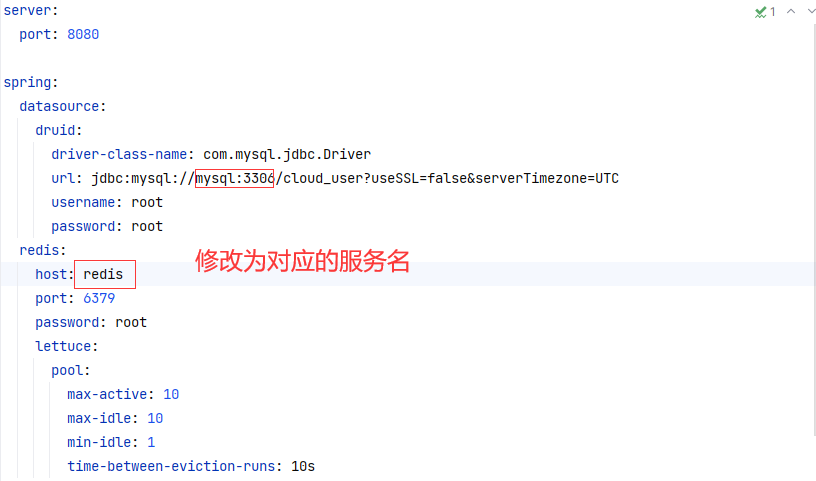

### 5.6.2执行docker-compose

```shell
docker-compose up -d
```

### 5.6.3关停

```shell
docker-compose stop
```


# 6.Docker轻量级可视化工具Portainer

## 6.1安装

## 6.1.1docker命令安装

```shell
docker run -d -p 8000:8000 -p 9000:9000 --name portainer --restart=always -v /var/run/docker.sock:/var/run/docker.sock -v portainer_data:/data portainer/portainer
```

> --restart=always：如果docker重启了，它也重启

## 6.1.2创建admin

访问：宿主机IP:9000

例如：http://192.168.88.133:9000/#/init/admin

### 6.1.3设置admin用户和密码后登录

# 7.Doker容器及监控之CAdvisor+InfluxDB+Granfana

## 7.1原生命令

```shell
docker stats
```

> 通过docker stats命令可以方便的看到当前宿主机所有容器的CPU，内存等信息，小公司够用了

## 7.2容器监控三剑客

CAdvisor监控收集+InfluxDB存储数据+Granfana展示图表

### 7.2.1CAdvisor

CAdvisor是一个容器资源监控工具,包括容器的内存,CPU,网络IO,磁盘Io等监控,同时提供了一个WEB页面用于查看容器的实时运行状态。CAdvisor默认存储2分钟的数据,而且只是针对单物理机。不过，CAdvisor提供了很多数据集成接口,支持InfluxDB,Redis,Kafka,Elasticsearch等集成,可以加上对应配置将监控数据发往这些数据库存储起来。

特点：

- 展示Host和容器两个层次的监控数据
- 展示历史变化数据

### 7.2.2InfluxDB

InfluxDB是用GO语言编写的开源分布式时序，事件和指标数据库，无需外部依赖

CAdvisor默认只在本机保存最近2分钟的数据，为了持久化存储数据和统一收集展示监控数据，需要将数据存储到InfluxDB中。InfluxDB是一个时序数据库,专门用于存储时序相关数据，很适合存储CAdvisor的数据。而且，CAdvisor本身已经提供了InfluxDB的集成方法，丰启动容器时指定配置即可。

**主要功能**

- 基于时间序列，支持与时间有关的相关函数（如最大，最小，求和）
- 可度量性：你可以实时对大量数据进行计算
- 基于事件：它支持任意的事件数据

### 7.2.3Granfana

Grafana是一个开源的数据监控分析可视化平台,支持多种数据源配置(支持的数据源包括InfluxDB,MySQLElasticsearch,OpenTSDB,Graphite等)和丰富的插件及模板功能,支持图表权限控制和报警。

**特点**

- 灵活丰富的图形化选项
- 可以混合多种风格
- 支持白天和黑夜模式
- 多个数据源

## 7.3Compose容器编排，一套流程

```shell
version: '3.1'

 

volumes:

  grafana_data: {}

 

services:

 influxdb:

  image: tutum/influxdb:0.9

  restart: always

  environment:

#创建cadvisor数据库

    - PRE_CREATE_DB=cadvisor

  ports:

    - "8083:8083"

    - "8086:8086"

  volumes:

    - ./data/influxdb:/data

 

 cadvisor:

  image: google/cadvisor

  links:

    - influxdb:influxsrv

  command: -storage_driver=influxdb -storage_driver_db=cadvisor -storage_driver_host=influxsrv:8086

  restart: always

  ports:

    - "8080:8080"

  volumes:

    - /:/rootfs:ro

    - /var/run:/var/run:rw

    - /sys:/sys:ro

    - /var/lib/docker/:/var/lib/docker:ro

 

 grafana:

  user: "104"

  image: grafana/grafana

  user: "104"

  restart: always

  links:

    - influxdb:influxsrv

  ports:

    - "3000:3000"

  volumes:

    - grafana_data:/var/lib/grafana

  environment:

    - HTTP_USER=admin

    - HTTP_PASS=admin

    - INFLUXDB_HOST=influxsrv

    - INFLUXDB_PORT=8086

    - INFLUXDB_NAME=cadvisor

    - INFLUXDB_USER=root

    - INFLUXDB_PASS=root
```

查看是否运行

```shell
docker 
```

